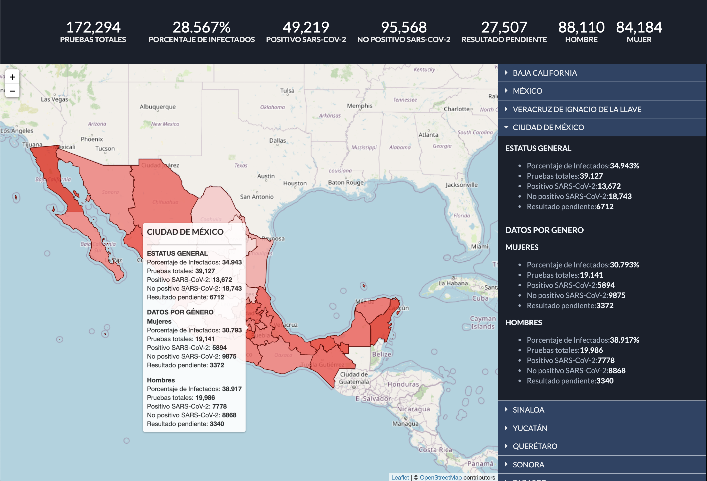

# WIP: Covid-19 México Dashboard
A Dashboard for display DGE data related to Covid-19 on México.



## Install
```bash
  npm install
```

## Run
```bash
  npm start
```

## Build for production
```
  npm run build
```

## Stack
* Semantic UI
* Leaflet
* React
* Tailwind
* PostCSS
* Babel
* Standard